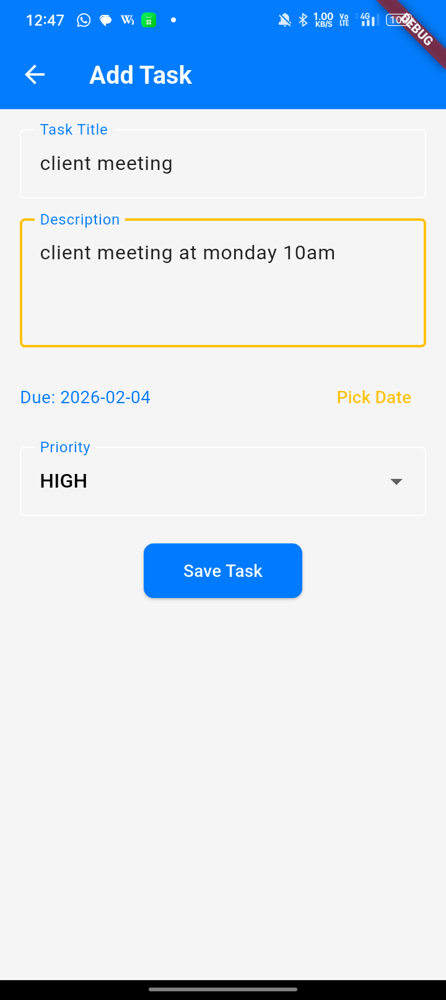
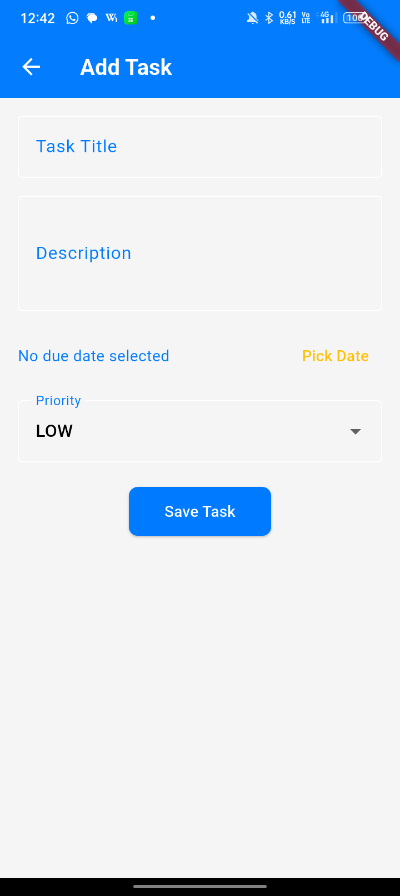
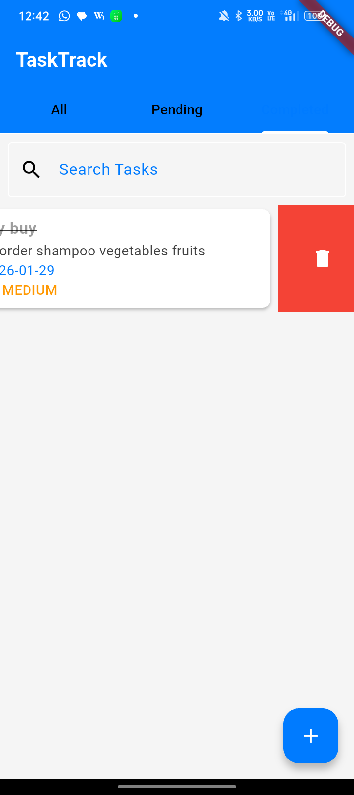
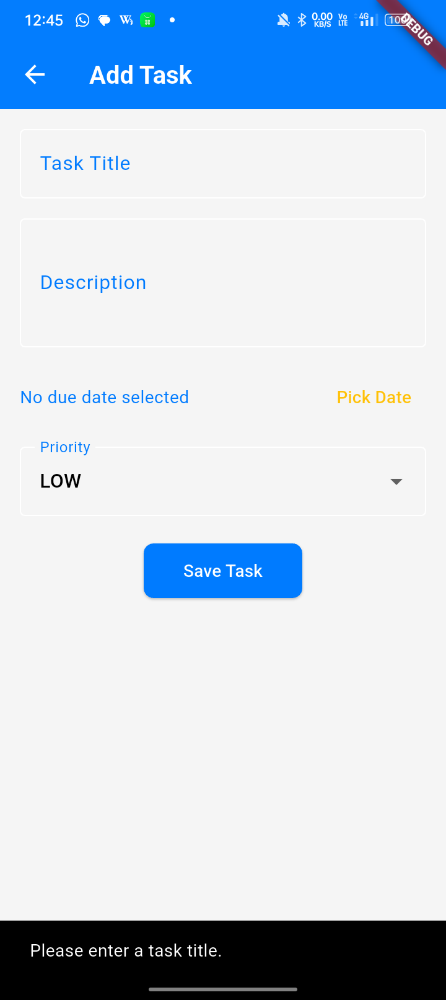
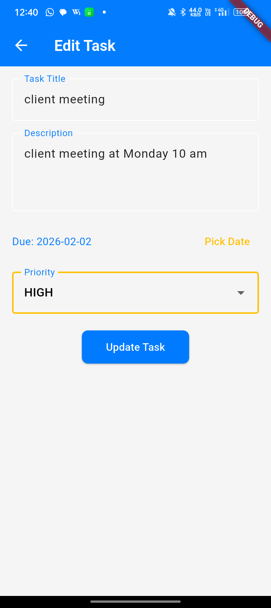
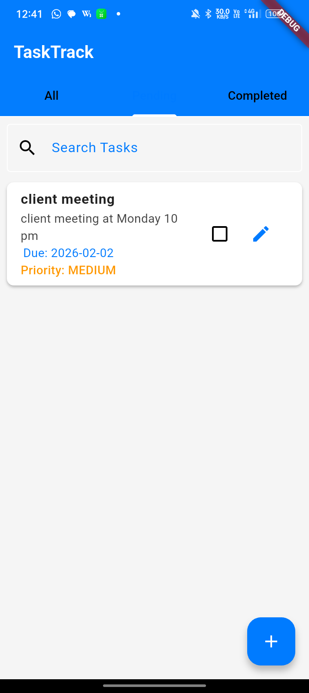

 Step 1: Create a New Flutter Project

Create a new Flutter project using:

flutter create task_app

Step 2: Replace lib Folder Files

Inside the lib folder, add the following files exactly as provided:

lib/
 ├── main.dart
 ├── models/
 │    └── task.dart
 ├── providers/
 │    └── task_provider.dart
 ├── screens/
 │    ├── home_screen.dart
 │    ├── add_task_screen.dart
 │    └── edit_task_screen.dart
 ├── widgets/
 │    └── task_tile.dart
 └── theme/
      └── app_theme.dart

Copy the content of each .dart file into its respective location.

Step 3: Add Dependencies

Open pubspec.yaml and add provider dependency:

dependencies:
  flutter:
    sdk: flutter
  provider: ^6.0.5

Then run:

flutter pub get

Step 4: Run the Application

Make sure an emulator or device is running, then execute:

flutter run

📱 App Flow (Based on Files)

main.dart → App entry point

home_screen.dart → Displays task list

add_task_screen.dart → Add new task

edit_task_screen.dart → Edit existing task

task_provider.dart → Manages task state

task.dart → Task model

task_tile.dart → UI for single task item

app_theme.dart → App theme and styling

